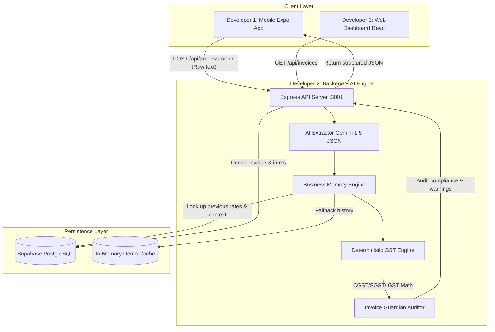

<<<<<<< HEAD
# Architecture Overview

## System architecture

Mobile App
React Native + Expo
|
v
Supabase
|
+--> PostgreSQL
|
+--> Edge Functions
|
v
LLM
|
+--> Invoice data
|
v
Web Dashboard

## Purpose

The application is designed around a simple, shared backend model: Supabase is the central source of truth for business, customer, order, product, and invoice data.

## Responsibilities

### Mobile App
- React Native + Expo
- Capture WhatsApp-style order content
- Create and update orders and invoice review flows
- Send structured data to the backend for AI processing

### Supabase
- Stores customer, business, order, and invoice records
- Acts as the shared database for both the mobile app and web dashboard
- Hosts server-side logic and Edge Functions for AI orchestration

### LLM
- Interprets raw order messages into structured order data
- Uses previous business order context as memory
- Explains anomalies and missing details in a predictable structured output

### Web Dashboard
- Reads invoice, customer, and business data
- Displays tracking, status, and invoice management workflows
- Provides a shared operational view for the business owner

## Data flow

- Mobile creates or updates orders and invoices in the shared Supabase database.
- Web reads invoice/customer/business data from the same database.
- AI processing happens server-side, not in the mobile or web client.
- LLM output should be structured JSON for downstream processing.

## Security and architecture rules

- API keys must never be exposed in the mobile or web client.
- Deterministic GST calculations should be implemented in code rather than delegated to the LLM.
- AI should handle interpretation, memory, and anomaly explanation, while the application logic remains deterministic.
- The mobile app and web app must use the same Supabase database for the demo flow.

## Scope for this hackathon

This project intentionally remains focused on a minimal end-to-end flow:
- order intake from a WhatsApp-style message
- AI extraction
- structured invoice generation
- shared storage and dashboard visibility

The backlog is intentionally small and aligned to the 5-hour demo window.
=======
# BillFlow AI — System Architecture

## Key Principles:
1. **Never let LLMs do GST math**: The AI extracts product names and quantities. The TypeScript engine calculates exact percentages, roundings, and tax breakdown deterministically.
2. **Business Memory**: Solves the real-world problem where customers say *"Send 10 more pipes at regular rate"*. Memory recovers previous rates automatically.
3. **Invoice Guardian**: Flags missing GSTIN, price anomalies (>₹100k or ₹0), and low confidence parsing so the shopkeeper is always in control before filing.
>>>>>>> 12d1e5d (chore: initialize BillFlow AI repository)
